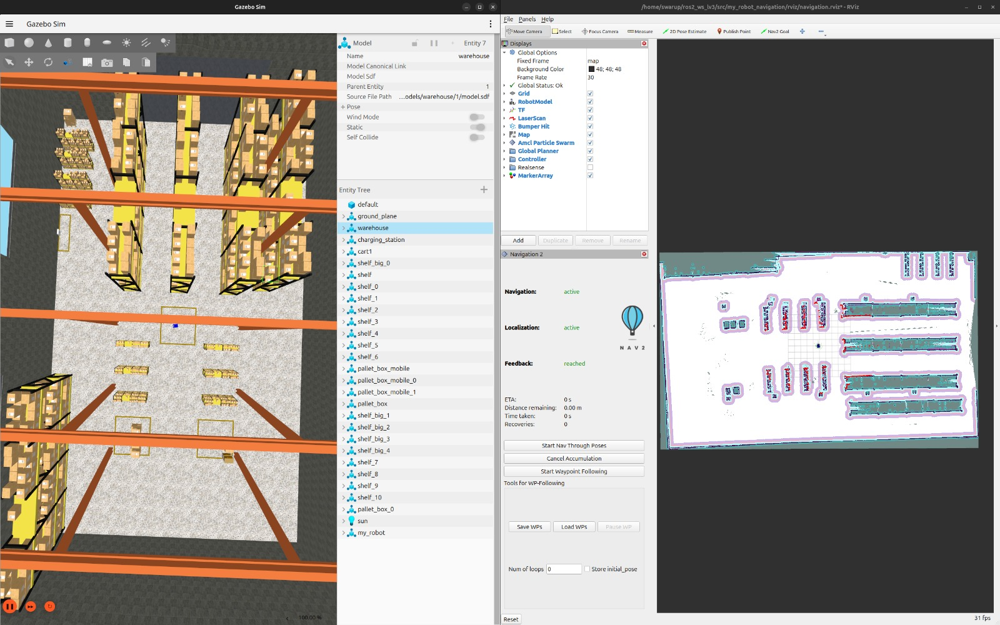
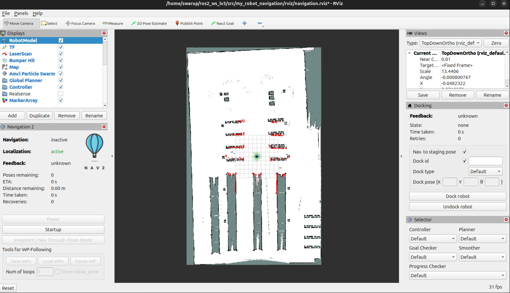

# 🤖 ROS2 SLAM & Navigation

A ROS 2 Jazzy project demonstrating autonomous mobile robot navigation using **SLAM Toolbox**, **Nav2**, **Gazebo Harmonic**, and **RViz2**.

The project includes:
- Differential Drive Mobile Robot
- LiDAR Sensor Integration
- Camera Sensor
- SLAM Mapping
- Autonomous Navigation
- Waypoint Navigation
- Gazebo Harmonic Simulation
- RViz2 Visualization

---

# 📌 Features

- ✅ ROS 2 Jazzy
- ✅ Gazebo Harmonic Simulation
- ✅ Differential Drive Mobile Robot
- ✅ LiDAR Sensor Integration
- ✅ Camera Sensor
- ✅ URDF/Xacro Robot Description
- ✅ SLAM Mapping
- ✅ Map Saving
- ✅ AMCL Localization
- ✅ Nav2 Navigation
- ✅ Waypoint Navigation
- ✅ RViz2 Visualization

---

# 🛠 Technologies Used

- ROS 2 Jazzy
- Gazebo Harmonic
- RViz2
- Nav2
- SLAM Toolbox
- URDF
- Xacro
- Python
- ros_gz_bridge

---

# 📋 Prerequisites

Before running this project, make sure the following are installed:

- Ubuntu 24.04
- ROS 2 Jazzy
- Gazebo Harmonic
- RViz2
- Nav2
- SLAM Toolbox
- colcon

---

# 📂 Project Structure

```text
ros2_ws_lv3/

├── src/
│
├── my_robot_bringup/
│   ├── config/
│   │   ├── gazebo_bridge.yaml
│   │   └── nav2_params.yaml
│   │
│   ├── launch/
│   │   └── my_robot_gazebo.launch.xml
│   │
│   ├── maps/
│   │   ├── warehouse_map.yaml
│   │   └── warehouse_map.pgm
│   │
│   └── worlds/
│       ├── my_world.sdf
│       └── warehouse.sdf
│
├── my_robot_description/
│   ├── launch/
│   ├── rviz/
│   └── urdf/
│
├── my_robot_navigation/
│   ├── config/
│   ├── launch/
│   ├── maps/
│   ├── rviz/
│   └── scripts/
│
├── media/
│
├── README.md
│
└── .gitignore
```

---

# 🚀 Build the Workspace

```bash
cd ~/ros2_ws_lv3

source /opt/ros/jazzy/setup.bash

colcon build --symlink-install

source install/setup.bash
```

---

# 🌍 Launch Gazebo Simulation

Open a new terminal.

```bash
cd ~/ros2_ws_lv3

source /opt/ros/jazzy/setup.bash

source install/setup.bash

ros2 launch my_robot_bringup my_robot_gazebo.launch.xml
```

This launches:

- Gazebo Harmonic
- Mobile Robot
- LiDAR
- Camera
- Robot State Publisher
- ros_gz_bridge

---

# 🗺️ Start SLAM Mapping

Open a new terminal.

```bash
cd ~/ros2_ws_lv3

source /opt/ros/jazzy/setup.bash

source install/setup.bash

ros2 launch slam_toolbox online_async_launch.py use_sim_time:=true
```

---

# 🖥️ Launch RViz for Mapping

Open another terminal.

```bash
cd ~/ros2_ws_lv3

source /opt/ros/jazzy/setup.bash

source install/setup.bash

rviz2 -d src/my_robot_navigation/rviz/slam.rviz
```

---

# 🎮 Teleoperate the Robot

Open another terminal.

```bash
cd ~/ros2_ws_lv3

source install/setup.bash

ros2 run teleop_twist_keyboard teleop_twist_keyboard
```

Drive the robot around the environment until the map is complete.

---

# 💾 Save the Map

```bash
cd ~/ros2_ws_lv3/src/my_robot_navigation/maps

ros2 run nav2_map_server map_saver_cli -f warehouse_map
```

Generated files:

```text
warehouse_map.yaml
warehouse_map.pgm
```

---

# 🚗 Launch Navigation

Stop SLAM using **Ctrl + C**.

Open a new terminal.

```bash
cd ~/ros2_ws_lv3

source /opt/ros/jazzy/setup.bash

source install/setup.bash

ros2 launch my_robot_navigation navigation.launch.py
```

---

# 🖥️ Launch RViz for Navigation

Open another terminal.

```bash
cd ~/ros2_ws_lv3

source /opt/ros/jazzy/setup.bash

source install/setup.bash

rviz2 -d src/my_robot_navigation/rviz/navigation.rviz
```

---

# 📍 Set Initial Pose

Inside RViz:

1. Click **2D Pose Estimate**
2. Click on the robot
3. Drag the arrow in the robot's facing direction

---

# 🎯 Send a Navigation Goal

Inside RViz:

1. Click **Nav2 Goal**
2. Select the destination on the map

The robot will autonomously navigate to the selected goal.

---

# 📌 Waypoint Navigation

Open a new terminal.

```bash
cd ~/ros2_ws_lv3

source /opt/ros/jazzy/setup.bash

source install/setup.bash

ros2 run my_robot_navigation waypoint_navigation
```

> **Note:** Replace `waypoint_navigation` with the installed executable name if it is different in your package.

---

# 📷 Screenshots

## Gazebo Simulation & RViz



---

## Generated Warehouse Map



---

# 🎥 Demo Video

[▶️ Watch Waypoint Navigation Demo](media/waypoint_nav.mp4)

---

# 🚀 Future Improvements

- Dynamic Obstacle Avoidance
- Autonomous Exploration
- Multi-Robot Navigation
- Camera-based Object Detection
- Dynamic Path Planning
- Path Optimization

---

# 👨‍💻 Author

**Swarup Jadhav**

B.Tech – Automation & Robotics

GitHub: https://github.com/swarup624

LinkedIn: *(Add your LinkedIn profile link here)*
